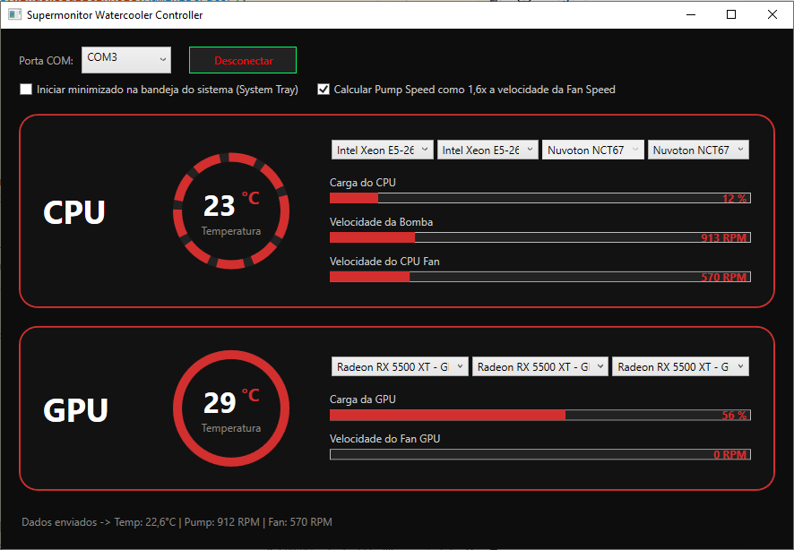
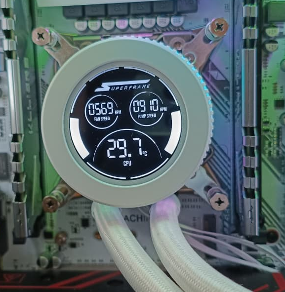

# Supermonitor Watercooler Controller

Aplicativo de monitoramento de informações de hardware em C# / WPF projetado para ler dados de sensores do sistema (CPU e GPU) e enviá-los via comunicação Serial (COM) para o display LCD do watercooler compatível e testado com o **Superframe Isengard Smart** no Sistema Operacional Microsoft Windows 10. 

Versão disponível para Linux no link: https://github.com/MaickonPrebianca/super-monitor-ch340

---

## 📷 Demonstração

| Interface do Aplicativo | Dispositivo em Execução |
| :---: | :---: |
|  |  |

---

## 🚀 Funcionalidades

- **Monitoramento em Tempo Real:** Leitura contínua de Temperatura, Carga (Load) e Rotação (RPM) de CPU e GPU via biblioteca `LibreHardwareMonitor`.
- **Mapeamento Dinâmico de Sensores:** Mapeamento customizado de cada barra de progresso diretamente pelos menus seletores na interface.
- **Cálculo Dinâmico da Bomba:** Opção de calcular a velocidade da bomba automaticamente (ex: 1,6x a rotação do fan) ou mapear o sensor físico da placa-mãe.
- **Persistência de Configurações:** Salva automaticamente as preferências de sensores, portas COM e opções de inicialização em formato JSON.
- **Minimizar para System Tray (Bandeja):** Execução contínua em segundo plano no menu do sistema.
- **Bypass de UAC Automático:** Criação automática de tarefa no Agendador do Windows com privilégios elevados na primeira execução, permitindo inicialização sem avisos repetitivos do Windows.

---

## 🛠️ Dependências

- **Runtime:** [.NET 8.0 Desktop Runtime](https://dotnet.microsoft.com/download/dotnet/8.0)
- **Bibliotecas C# / NuGet:**
  - `LibreHardwareMonitorLib` (0.9.3 ou superior) https://github.com/LibreHardwareMonitor/LibreHardwareMonitor/tree/master/LibreHardwareMonitorLib
  - `System.IO.Ports`
  - `System.Text.Json`

---

## 📦 Instalação e Execução

### Opção 1: Executável Direto (Recomendado)
1. Baixe a última versão na seção [Releases](../../releases).
2. Extraia os arquivos e execute o `AIOController.exe`.
3. **Importante:** O aplicativo **deve ser executado como Administrador** na primeira vez para que a biblioteca de hardware possa acessar os sensores do sistema e para registrar a tarefa no Agendador do Windows.

### Opção 2: Compilando do Código Fonte
1. Clone o repositório:
   ```bash
   git clone [https://github.com/seu-usuario/AIOController.git](https://github.com/seu-usuario/AIOController.git)
